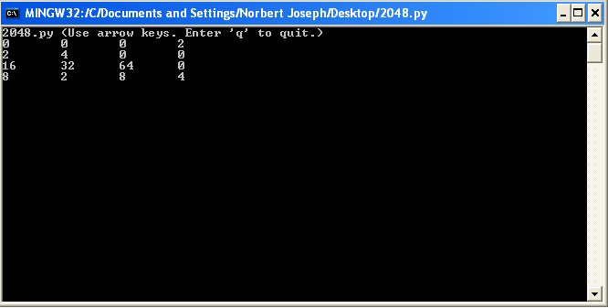

[lib2048]() - Various Frameworks for Implementing 2048
=======

```lib2048``` aims to provide various libraries for implementing the popular game 2048. Below is an image of a barebones 2048 implementation that can be created:



The following is the code used to create it.

```python
# Import the 2048 library
import lib2048

# Import WConio to handle keypresses and whatnot
import WConio

# Import OS to access ability to flush stdout
import os
clear = lambda: os.system('cls')

# Create Game
board = lib2048.Game(4,4)
board.set()

# Prints the graphics to the console
def printGraphics(matrix):
    s = [[str(e) for e in row] for row in matrix]
    lens = [max(map(len, col)) for col in zip(*s)]
    fmt = '\t'.join('{{:{}}}'.format(x) for x in lens)
    table = [fmt.format(*row) for row in s]
    print '\n'.join(table)

# Enter input loop
key = ' '
while key != 'q':
    # Print the game board
    clear()
    print "2048.py (Use arrow keys. Enter 'q' to quit.)"
    printGraphics(board.grid)

    # Get the key press
    key = WConio.getkey()
    if key == 'up':
        board.shiftUp()
    elif key == 'down':
        board.shiftDown()
    elif key == 'left':
        board.shiftLeft()
    elif key == 'right':
        board.shiftRight()
```
